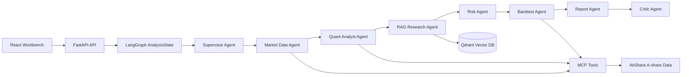

# Multi-Agent Trading System

多智能体协作的 A 股量化研究平台。项目把行情数据、技术指标、RAG 证据检索、风险评估、策略回测、报告生成和结论校验拆成多个专业 Agent，用 LangGraph 编排共享状态，前端实时展示每个 Agent 的执行轨迹。

> This project is for research and education only. It is not investment advice and does not provide live trading.

## Architecture



## Multi-Agent Workflow

The backend exposes a specialist-agent workflow:

- `Supervisor Agent`: accepts the request and creates an execution plan.
- `Market Data Agent`: fetches A-share OHLCV data through AkShare with deterministic sample fallback.
- `Quant Analyst Agent`: calculates MA, RSI, MACD, volatility, drawdown, and trend features.
- `RAG Research Agent`: retrieves market evidence from the RAG store and returns citations.
- `Risk Agent`: scores volatility, drawdown, sentiment, and user risk preference.
- `Backtest Agent`: runs a moving-average crossover strategy.
- `Report Agent`: synthesizes a structured research report.
- `Critic Agent`: validates confidence, missing data, and citation coverage.

The frontend shows this chain in the `Agent Flow` panel through the `/api/analysis/{run_id}/events` SSE stream.

## Tech Stack

- Agent orchestration: LangGraph with a deterministic fallback runner.
- API: FastAPI, Pydantic, Server-Sent Events.
- RAG/vector store: Qdrant-ready design with local in-memory fallback for v1 demos.
- MCP: Python MCP server exposing market-analysis tools.
- Data: AkShare for A-share history, sample data fallback for stable demos/tests.
- Frontend: React, Vite, TypeScript, Recharts, lucide-react.
- Infra: Docker Compose and Kubernetes manifests.

## Quick Start

```powershell
cp .env.example .env
cd backend
python -m venv .venv
.\.venv\Scripts\Activate.ps1
pip install -e ".[dev]"
uvicorn app.main:app --reload --port 8000
```

In another terminal:

```powershell
cd frontend
npm install
npm run dev
```

Open `http://localhost:5173` and run the default `000001` analysis.

## Docker Compose

```powershell
cp .env.example .env
docker compose up --build
```

- Frontend: `http://localhost:8080`
- Backend: `http://localhost:8000`
- Qdrant: `http://localhost:6333`

## Public API

```http
POST /api/analyze
GET  /api/analysis/{run_id}
GET  /api/analysis/{run_id}/events
GET  /api/stocks/search?q=000001
POST /api/rag/ingest
```

Example request:

```json
{
  "symbol": "000001",
  "start_date": "2024-01-01",
  "end_date": "2024-12-31",
  "horizon": "1m",
  "risk_preference": "balanced"
}
```

## MCP Tools

Run the MCP server:

```powershell
cd backend
python -m app.mcp_server.server
```

Exposed tools:

- `get_stock_history`
- `calculate_indicators`
- `search_market_research`
- `run_backtest`
- `generate_risk_profile`

## Kubernetes

The K8s manifests are under `infra/k8s`.

```powershell
kubectl kustomize infra/k8s
kubectl apply -k infra/k8s
```

Before real deployment, replace `infra/k8s/secret.example.yaml` with a real secret and push backend/frontend images matching the names in the manifests.

## Tests

```powershell
cd backend
pytest

cd ../frontend
npm test
npm run test:e2e
```

## Resume Bullets

- Built a multi-agent A-share quantitative research platform with FastAPI, LangGraph, React, Qdrant, MCP, Docker, and Kubernetes manifests.
- Designed a Supervisor-led Agent workflow that decomposes stock analysis into market data, quantitative indicators, RAG evidence retrieval, risk scoring, backtesting, report generation, and critic validation.
- Implemented SSE-based Agent execution tracing so the frontend can visualize specialist Agent status, outputs, citations, and final research reports in real time.
- Added AkShare data integration with deterministic sample fallback, pytest/Vitest/Playwright coverage, Docker Compose local deployment, and K8s deployment manifests.
