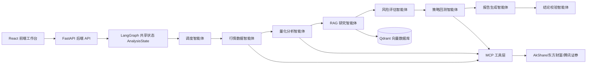

# 多智能体量化股票分析系统

`multi-agent-trading-system` 是一个面向简历展示的 A 股量化研究平台。项目把行情数据、技术指标、RAG 证据检索、风险评估、策略回测、报告生成和结论校验拆分为多个专业智能体，并通过 LangGraph 风格的共享状态工作流进行编排。前端工作台会实时展示每个智能体的执行轨迹、阶段产出、引用证据和最终研究报告。

> 本项目仅用于研究、学习和工程能力展示，不构成任何投资建议，也不提供实盘交易能力。

## 语言约定

- 项目 README、演示汇报、分析报告和前端界面默认使用中文。
- 后端接口字段、环境变量、目录名和代码标识符保留英文，方便工程协作和开源维护。
- 面试或答辩时，建议用中文讲清业务闭环，用英文技术名词标识核心组件，例如 LangGraph、RAG、MCP、Qdrant、Docker 和 Kubernetes。

## 架构设计



## 多智能体协作流程

后端提供一条专业智能体协作链路：

- `Supervisor Agent`：接收用户分析请求，拆解任务并生成执行计划。
- `Market Data Agent`：按 AkShare、东方财富直连、腾讯证券、确定性样例数据的顺序获取 A 股 OHLCV 历史行情，并返回数据源元信息。
- `Quant Analyst Agent`：计算均线、RSI、MACD、年化波动率、最大回撤和趋势特征。
- `RAG Research Agent`：从 RAG 知识库检索市场证据，并返回可追溯引用。
- `Risk Agent`：结合波动率、回撤、证据情绪和用户风险偏好生成风险画像。
- `Backtest Agent`：执行均线交叉策略回测，输出收益、回撤、胜率和交易次数。
- `Report Agent`：整合各智能体产出，生成结构化中文研究报告。
- `Critic Agent`：校验报告置信度、数据完整性和引用覆盖情况。

前端通过 `/api/analysis/{run_id}/events` 的 SSE 事件流，在“智能体流程”面板中实时展示这条协作链路。

## 技术栈

- 智能体编排：LangGraph 风格工作流，提供确定性兜底执行器。
- 后端服务：FastAPI、Pydantic、SSE 事件流。
- 大模型接入：OpenAI 兼容 `/chat/completions`，未配置 Key 时自动使用规则兜底。
- RAG 与向量库：Qdrant 优先，本地内存检索作为离线演示兜底。
- MCP：Python MCP server，将行情、指标、RAG、回测和风险画像封装为工具。
- 数据源：优先使用 AkShare A 股历史行情；当上游接口或代理异常时，依次切换东方财富直连、腾讯证券，最后才使用样例数据兜底。
- 策略回测：支持买入持有、均线交叉、动量策略、RSI 反转的对比评估。
- 前端：React、Vite、TypeScript、Recharts、lucide-react。
- 工程化：Docker Compose、本地开发脚本、Kubernetes 部署清单。

## 快速启动

后端：

```powershell
cp .env.example .env
cd backend
python -m venv .venv
.\.venv\Scripts\Activate.ps1
pip install -e ".[dev]"
uvicorn app.main:app --reload --port 8000
```

另开一个终端启动前端：

```powershell
cd frontend
npm install
npm run dev
```

打开 `http://localhost:5173`，使用默认股票代码 `000001` 即可运行一次完整分析。

## 大模型配置

系统默认不强制依赖大模型 API。未配置 Key 时，会使用规则引擎完成量化指标、RAG 检索、风险评估、回测、报告生成和校验；配置 Key 后，`Report Agent` 与 `Critic Agent` 会自动切换为大模型增强模式。

OpenAI 示例：

```env
OPENAI_API_KEY=你的_key
OPENAI_BASE_URL=https://api.openai.com/v1
OPENAI_MODEL=gpt-4o-mini
LLM_TIMEOUT_SECONDS=30
```

DeepSeek 示例：

```env
OPENAI_API_KEY=你的_deepseek_key
OPENAI_BASE_URL=https://api.deepseek.com
OPENAI_MODEL=deepseek-v4-flash
LLM_TIMEOUT_SECONDS=60
```

页面最终报告会显示当前是“规则模式”还是“大模型增强”。

## Docker Compose

```powershell
cp .env.example .env
docker compose up --build
```

- 前端：`http://localhost:8080`
- 后端：`http://localhost:8000`
- Qdrant：`http://localhost:6333`

## API 接口

```http
POST /api/analyze
GET  /api/analysis/{run_id}
GET  /api/analysis/{run_id}/events
GET  /api/stocks/search?q=000001
POST /api/rag/ingest
```

示例请求：

```json
{
  "symbol": "000001",
  "start_date": "2026-01-01",
  "end_date": "2026-06-04",
  "horizon": "1m",
  "risk_preference": "balanced",
  "backtest_config": {
    "strategy_set": "compare_all",
    "short_window": 5,
    "long_window": 20,
    "momentum_window": 20,
    "rsi_window": 14,
    "rsi_buy_threshold": 30,
    "rsi_sell_threshold": 70,
    "initial_cash": 100000,
    "fee_rate": 0.0003
  }
}
```

## MCP 工具

启动 MCP 服务：

```powershell
cd backend
python -m app.mcp_server.server
```

当前暴露的工具：

- `get_stock_history`：获取 A 股历史行情。
- `calculate_indicators`：计算技术指标。
- `search_market_research`：检索 RAG 市场证据。
- `run_backtest`：执行默认均线交叉策略回测。
- `generate_risk_profile`：生成风险画像。

## Kubernetes

K8s 清单位于 `infra/k8s`。

```powershell
kubectl kustomize infra/k8s
kubectl apply -k infra/k8s
```

真实部署前，需要将 `infra/k8s/secret.example.yaml` 替换为真实 Secret，并推送与清单中镜像名匹配的后端和前端镜像。

## 测试

```powershell
cd backend
pytest

cd ../frontend
npm test
npm run test:e2e
```

## 简历描述示例

- 基于 FastAPI、LangGraph、React、Qdrant、MCP、Docker 和 Kubernetes 构建多智能体 A 股量化研究平台。
- 设计 Supervisor 驱动的多智能体工作流，将股票分析拆分为行情采集、量化指标计算、RAG 证据检索、风险评分、策略回测、报告生成和结论校验。
- 实现基于 SSE 的智能体执行轨迹推送，使前端能够实时展示各专业智能体的状态、产出、引用证据和最终中文研究报告。
- 接入 AkShare、东方财富和腾讯证券多级 A 股数据源，并提供确定性样例数据兜底；补充 pytest、Vitest、Playwright 测试，以及 Docker Compose 和 K8s 部署清单。

## 当前状态

- 后端已支持完整分析链路和中文报告生成。
- 前端已支持中文工作台、智能体流程展示、指标面板、专业 K 线、多策略回测对比、RAG 证据和最终报告展示。
- Docker Compose 可用于本地一键启动，K8s manifests 可用于部署展示和面试讲解。
